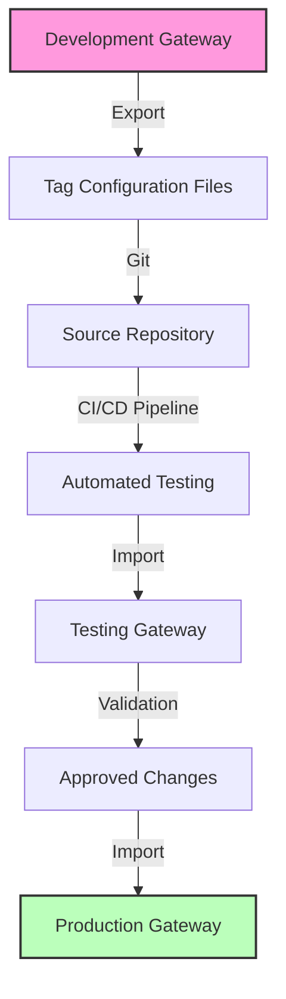
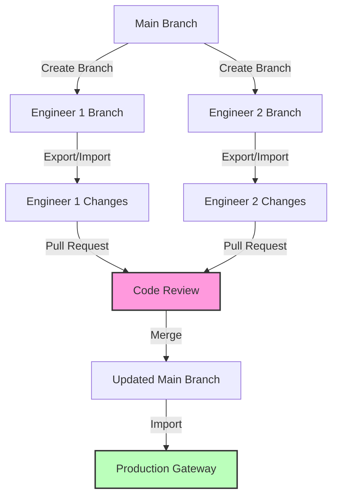

# Common Use Cases

The Tag CICD Module addresses a variety of real-world challenges in industrial automation. Here are some common scenarios where this module provides significant value.

## Version Control for Tags

### The Challenge

Industrial facilities often have thousands of tags configured in their Ignition systems. Without version control, it's difficult to:
- Track who made changes to tag configurations
- Understand when and why changes were made
- Roll back problematic changes
- Compare tag configurations between different points in time

### The Solution

With the Tag CICD Module, you can:

1. Export tag configurations to JSON files
2. Store these files in a Git repository
3. Use standard Git workflows for change tracking
4. Record changes with meaningful commit messages
5. View history and differences over time
6. Create branches for experimental changes

## Multi-Environment Consistency

### The Challenge

Most industrial organizations maintain multiple environments (development, testing, staging, production). Ensuring tag configurations remain consistent across these environments is challenging with manual processes.

### The Solution

The Tag CICD Module enables a structured promotion process:

1. Develop and test changes in a development environment
2. Export and version the changes
3. Promote tested configurations to staging
4. Finally deploy to production with confidence

This ensures that production always runs validated tag configurations that have passed through the proper testing channels.

## System Backup & Disaster Recovery

### The Challenge

Tag configurations represent critical operational knowledge. Losing this configuration due to system failures can result in significant downtime and knowledge loss.

### The Solution

The Tag CICD Module provides reliable backup and restoration capabilities:

1. Regularly export tag configurations to the gateways file system.
2. Quickly restore tag configurations after a system failure
3. Maintain multiple versions in version control for easy rollback

## Collaborative Tag Development

### The Challenge

When multiple engineers work on the same Ignition project, coordinating tag changes becomes difficult. Without proper tools, engineers might overwrite each other's work or introduce conflicting changes.

### The Solution

Using the Tag CICD Module with version control across multiple developer's local gateways:

1. Engineers work in isolated branches
2. Export and commit their changes
3. Create pull requests for review
4. Merge approved changes to the main branch
5. Deploy the combined changes to production

This workflow minimizes conflicts and ensures changes are reviewed before deployment.

## Template-Based Deployments

### The Challenge

When deploying similar systems across multiple sites or machines, recreating tag configurations manually is time-consuming and error-prone.

### The Solution

The Tag CICD Module enables template-based deployments:

1. Create a template tag configuration
2. Store it in version control
3. Customize specific parameters for each deployment
4. Use the module's import functionality to deploy to each system
5. Maintain consistency while allowing for site-specific customizations

## Automated Testing

### The Challenge

Testing tag configuration changes manually is tedious and often overlooked, leading to potential issues in production.

### The Solution

Integration with CI/CD pipelines allows automated testing:

1. Export tag configurations from development
2. Run automated validation scripts in the CI pipeline
3. Simulate tag behavior in test environments
4. Verify configurations meet design requirements
5. Only promote configurations that pass all tests
