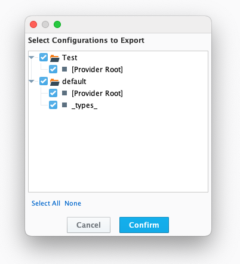

# Tag CICD Module

This module enables CICD (Continuous Integration and Continuous Delivery) practices for Ignition tags. It provides comprehensive capabilities for exporting and importing tag configurations between an Ignition gateway and a git repository. This allows teams to track tag changes, implement version control, and roll back changes when needed.

## Core Features

- **Tag Export/Import**: Export tags from and import tags to any Ignition tag provider
- **Hierarchical Export/Import**: Support for full tag hierarchies with provider, folder, and tag structures
- **Deterministic JSON Sorting**: Creates deterministically sorted JSON data for better source control tracking
- **UDT Support**: Special handling for UDT definitions with dependency resolution during import/export
- **Flexible Collision Handling**: Multiple collision policies for tag imports
- **Both Designer and REST API Access**: Use either Designer UI or REST endpoints for operations
- **Individual or Consolidated Files**: Option to export tags as individual files or as a single consolidated JSON file
- **Automated Import on Startup**: Automatically import tags from configuration on module startup

## Designer Interface

The module adds a Tag CICD toolbar in the Ignition Designer with export and import buttons:


Clicking either button displays a configuration selection dialog where you can choose which tag configurations to export or import:



## API Endpoints

### Export Tags

`GET /data/tag-cicd/tags/export`

Exports tag configuration as a JSON string.

#### Parameters

| Name | Type | Description |
| ---- | ---- | ----------- |
| `provider` | `string` | The tag provider to export from. Defaults to `default` if not specified. |
| `baseTagPath` | `string` | The base tag path to start the export from. Defaults to an empty string (root of tag provider). |
| `recursive` | `boolean` | If `true`, recursively includes all tags and folders under the `baseTagPath`. |
| `localPropsOnly` | `boolean` | If `true`, only exports local properties of tags (user-created configuration). |

#### Example Usage

```sh
curl "https://your-gateway.com/data/tag-cicd/tags/export?provider=default&baseTagPath=MyTagFolder&recursive=true&localPropsOnly=true"
```

### Export Tags to File

`POST /data/tag-cicd/tags/export`

Exports tag configuration and saves it to a specified file path on the Ignition gateway server.

#### Parameters

| Name | Type | Description |
| ---- | ---- | ----------- |
| `provider` | `string` | The tag provider to export from. Defaults to `default` if not specified. |
| `baseTagPath` | `string` | The base tag path to start the export from. Defaults to an empty string (root of tag provider). |
| `recursive` | `boolean` | If `true`, recursively includes all tags and folders under the `baseTagPath`. |
| `localPropsOnly` | `boolean` | If `true`, only exports local properties of tags (user-created configuration). |
| `filePath` | `string` | The file path on the Ignition gateway server where the exported tag configuration will be saved. Required. |
| `individualFilesPerObject` | `boolean` | If `true`, creates individual JSON files for each tag and folder, maintaining the tag hierarchy. |
| `deleteExisting` | `boolean` | If `true`, deletes existing files/directories in the export directory not being replaced. Defaults to `false`. |
| `excludeUdtDefinitions` | `boolean` | If `true`, excludes UDT definitions (e.g., `_types_` folder) from the export. Defaults to `false`. |

#### Example Usage

```sh
curl -X POST "http://your-gateway.com/data/tag-cicd/tags/export?provider=default&baseTagPath=MyTagFolder&recursive=true&localPropsOnly=true&filePath=data/projects/my-project/tags.json&individualFilesPerObject=false&deleteExisting=true"
```

### Import Tags

`POST /data/tag-cicd/tags/import`

Imports a tag configuration from a JSON string in the request body or from a file path.

#### Parameters

| Name | Type | Description |
| ---- | ---- | ----------- |
| `provider` | `string` | The tag provider to import into. Defaults to `default` if not specified. |
| `baseTagPath` | `string` | The base tag path where the imported tags will be created/updated. Defaults to an empty string (root of tag provider). |
| `collisionPolicy` | `string` | The collision policy to use when importing tags. Valid values: `"a"` (abort), `"o"` (overwrite), `"u"` (update), `"d"` (delete and overwrite). Defaults to `"a"`. |
| `filePath` | `string` | The file path on the Ignition gateway server from where the tag configuration will be imported. Required when `individualFilesPerObject` is `true`. |
| `individualFilesPerObject` | `boolean` | If `true`, expects individual JSON files for each tag and folder. The `filePath` should point to the directory containing the JSON files. |

#### Example Usage

```sh
# When using individualFilesPerObject=true:
curl -X POST "http://your-gateway.com/data/tag-cicd/tags/import?provider=default&baseTagPath=MyTagFolder&collisionPolicy=o&filePath=/path/to/tag_directory&individualFilesPerObject=true"

# When using individualFilesPerObject=false (with JSON in request body):
curl -X POST -H "Content-Type: application/json" -d @path/to/tag_configuration.json "http://your-gateway.com/data/tag-cicd/tags/import?provider=default&baseTagPath=MyTagFolder&collisionPolicy=o&individualFilesPerObject=false"
```

### Delete Tags

`DELETE /data/tag-cicd/tags/delete`

Deletes tags from a specified provider and path.

#### Parameters

| Name | Type | Description |
| ---- | ---- | ----------- |
| `provider` | `string` | The tag provider to delete from. Defaults to `default` if not specified. |
| `tagPath` | `string` | The tag path to delete. Defaults to an empty string (root of tag provider). |
| `recursive` | `boolean` | If `true`, recursively deletes all tags and folders under the `tagPath`. |

#### Example Usage

```sh
curl -X DELETE "http://your-gateway.com/data/tag-cicd/tags/delete?provider=default&tagPath=MyTagFolder&recursive=true"
```

### Get Tag Configuration

`GET /data/tag-cicd/tags/config`

Retrieves the tag configuration from the `tag-cicd-config.json` file.

#### Example Usage

```sh
curl "http://your-gateway.com/data/tag-cicd/tags/config"
```

## Configuration File

The module uses a configuration file located at `data/modules/com.bwdesigngroup.ignition.tag_cicd/tag-cicd-config.json`. This file contains an array of tag configurations that can be used for automated import/export operations.

Example configuration file:

```json
[
  {
    "provider": "default",
    "baseTagPath": "MyTagFolder",
    "sourcePath": "/path/to/export/mytagfolder",
    "individualFilesPerObject": true,
    "collisionPolicy": "o",
    "excludeUdtDefinitions": false
  },
  {
    "provider": "another_provider",
    "baseTagPath": "",
    "sourcePath": "/path/to/export/another_provider_tags.json",
    "individualFilesPerObject": false,
    "collisionPolicy": "d"
  }
]
```

## UDT Type Handling

The module includes special handling for UDT types, ensuring they are imported in the correct order based on dependencies:

1. UDT types are identified and separated from regular tags during export/import
2. Dependencies between UDT types are analyzed
3. A topological sort is performed to determine the correct import order
4. UDT types are then imported in dependency order to ensure proper resolution

## Collision Policies

When importing tags, the following collision policies are available:

- `a` (abort): Abort the import if a tag with the same path already exists
- `o` (overwrite): Completely replace existing tags with the imported tags
- `u` (update): Update properties of existing tags with values from the imported tags
- `d` (delete and overwrite): Delete all existing tags in the target path before importing

## Building the Module

Within the root directory there is a file named `gradle.properties.template`. This file should be copied to `gradle.properties` and the properties within it should be filled out with the appropriate values.

| Property | Description |
| -------- | ----------- |
| `ignition.signing.keystoreFile` | The path to the keystore file. |
| `ignition.signing.keystorePassword` | The password for the keystore. |
| `ignition.signing.certFile` | The path to the certificate file. |
| `ignition.signing.certAlias` | The alias of the certificate. |
| `ignition.signing.certPassword` | The password for the certificate. |

Once the `gradle.properties` file has been filled out, the module can be built by running the following command:

```sh
./gradlew build
```

### Example Environment Setup

#### Leveraging SDKMAN

1. Install SDKMAN

```sh
curl -s "https://get.sdkman.io" | bash
```

2. Install Java

```sh
sdk install java java 17.0.11-zulu
```

3. Install Gradle

```sh
sdk install gradle 7.5.1
```

4. If you are going to deploy to a gateway with non-standard certificates installed, you will need to add the gateway's certificate to the Java truststore. This can be done by running the following commands:

```sh
keytool -import -cacerts -alias root_ca -file /path/to/root_ca.crt  -storepass changeit
keytool -import -cacerts -alias server_cert -file /path/to/server.crt -storepass changeit
```

## Deterministic JSON Export

During the export process, the module creates a deterministically sorted copy of the JSON data to ensure that source control is not confused when a new file gets saved, and the keys are accidentally reordered. This process is applied recursively to all nested arrays and objects within the JSON data.

This is particularly helpful for:
- Minimizing unnecessary changes in git repositories
- Making tag differences easier to review in pull requests
- Ensuring consistent file content regardless of the order of tag properties

## Automatic Tag Import on Gateway Startup

The module can automatically import tags from configured sources when the gateway starts up. This feature is enabled by default and uses the configurations defined in the `tag-cicd-config.json` file.

## Designer Integration

The module integrates with the Ignition Designer by adding:

1. A Tag CICD toolbar with Export and Import buttons
2. A configuration selection dialog that displays available tag configurations
3. Real-time status updates during export/import operations
4. Visual indication of successful and failed operations
